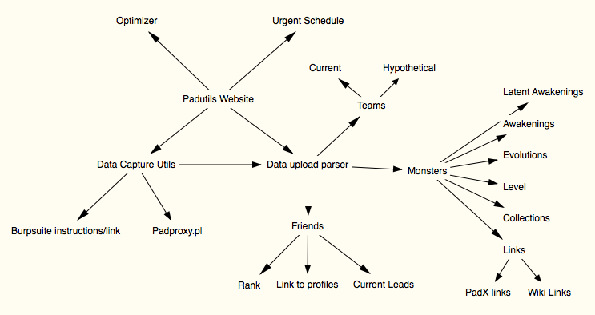

PADUTILS

Description:
Using MongoDB and PHP this project will provide an opensource alternative to PADHerder.  Initial data for the database has been gotten from PuzzleDragonX but eventually will pulled directly from the game source files.  The optomizer can be found at: https://adambot.github.io/padopt/index.html and is also under active development.

The MongoDB for the Github page is currently hosted at MongoLab under the free tier and backups without the profiles collection will be available on a weekly basis for dev and on a per-release basis for stable.

Planned Features:

